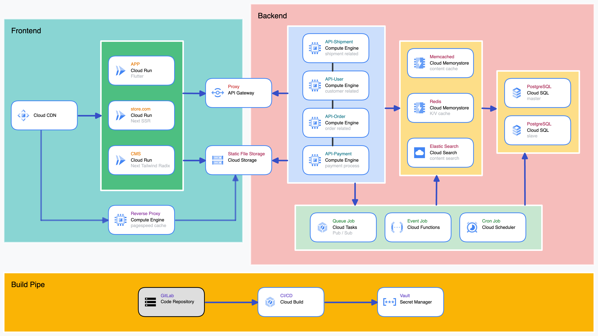

# NX DDD Workspace

Nx + NestJs + Next DDD example project.

## Introduction

Infra architecture example


### Environment

- Node.js LTS 18+
- PNPM
- Docker & Docker Compose

## Installation

```bash
user> git clone :repo-link
user> cd repo
user> pnpm i --frozen-lockfile
user> docker-compose up
user> nx run mikro-orm-model:build
user> nx run mikro-orm-model:migrate:up
```

### Dev

```
nx run api-internal:serve
nx run store.com:serve
```
